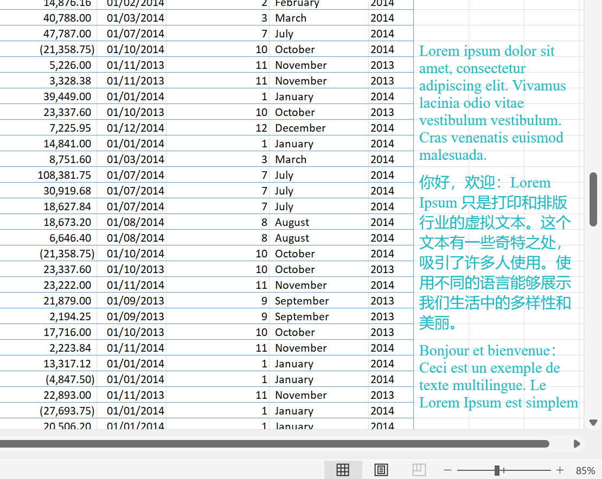
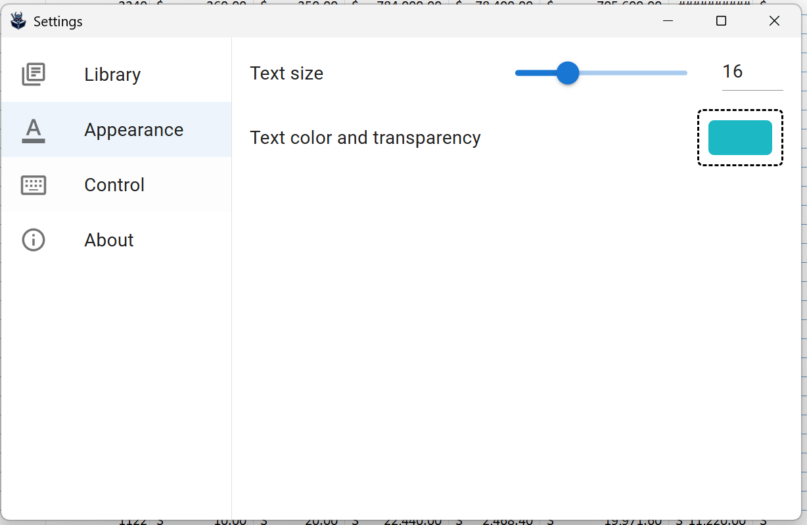

# Sneaky Reader

This is a desktop app that enables you to read books **sneakily** at work!

Currently only available on Windows. Will add support to MacOS and Linux (with X11 desktop environment) in the future.

## Screenshots

## Features

- 3 modes to switch showing or hiding the text.
  - Press to show. Press again to hide.
  - Hold to show. Release to hide.
  - Double press, but hold at the second time to show. Then release to hide.
- Custom keyboard keys, mouse buttons, mouse wheels.
- Resize and move reader window.
- Adjust text size, color, transparency.
- Support texts with non-UTF-8 legacy encodings (e.g., GBK, BIG5, SHIFT-JIS).
